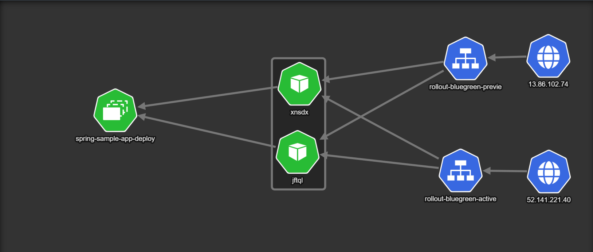

Argo Rollouts provides comprehensive support for blue-green deployments, which allow teams to deploy new versions of an application alongside the existing version, and gradually shift traffic from the old version to the new version.

Here's how a blue-green deployment might work with Argo Rollouts:

- Define the rollout strategy: The first step is to define the rollout strategy for the blue-green deployment. This might involve setting the number of replicas for the new and old versions of the application, configuring the traffic split between the two versions, and defining the criteria for promoting or rolling back the deployment.

- Create the rollout object: The next step is to create the rollout object in Kubernetes, which defines the rollout strategy and the associated resources, such as the deployment, the service, and the ingress or route.

- Deploy the new version: Argo Rollouts then deploys the new version of the application, and gradually increases the traffic to the new version, while decreasing the traffic to the old version. Argo Rollouts monitors the health and performance of the new version, and can automatically pause or roll back the rollout if any issues or errors are detected.

- Monitor the rollout status: Teams can monitor the status of the blue-green deployment using the Argo Rollouts CLI or the Kubernetes dashboard. They can view the status of the rollout, the traffic split between the old and new versions, and the performance metrics for each version.

- Promote or rollback the deployment: Once the new version has been fully deployed and validated, teams can promote the deployment, which will switch all traffic to the new version and shut down the old version. Alternatively, if any issues or errors are detected, teams can roll back the deployment, which will revert to the previous version and ensure that the application remains stable and available.

By using Argo Rollouts for blue-green deployments, teams can reduce the risk and impact of software releases, and can deploy new features and updates to users in a controlled and automated manner. Argo Rollouts also provides tools for monitoring and validating the rollout, and for automatically promoting or rolling back the deployment based on predefined criteria and metrics.



Deploying a blue-green deployment using Argo Rollouts can be performed using the following steps:

### [Windows](#tab/powershell)

```powershell
argocd app create blue-green-app `
--repo https://github.com/bet01/workshops `
--project default `
--path 'argocd/blue-green-app' `
--dest-server https://kubernetes.default.svc `
--dest-namespace argo-rollouts
```

### [Mac](#tab/bash)

```bash
argocd app create blue-green-app \
--repo https://github.com/bet01/workshops \
--project default \
--path 'argocd/blue-green-app' \
--dest-server https://kubernetes.default.svc \
--dest-namespace argo-rollouts
```
